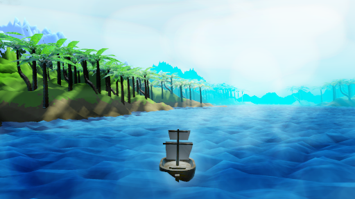

# Valley of Shaders

Small project to learn shaders and optimalization in Godot Engine

## Goals

- terrain shader optimalization
- terrain shader coloring (without textures)
- units movement optimalization (using heightmap)
- camera movement desined for gamepad
- easy changing levels (terrains)
